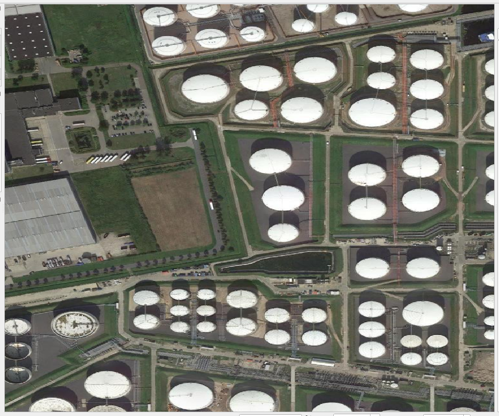
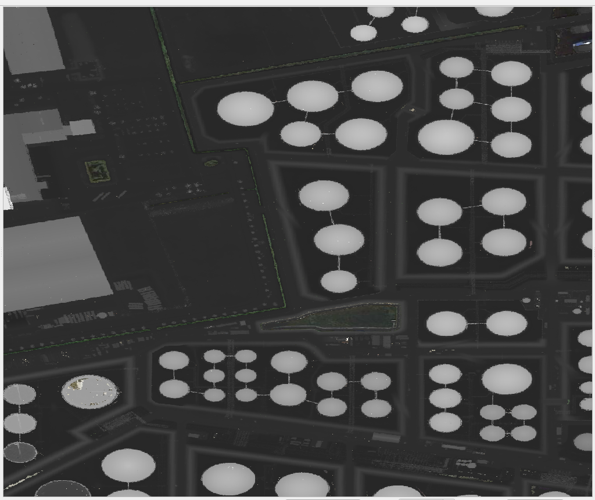
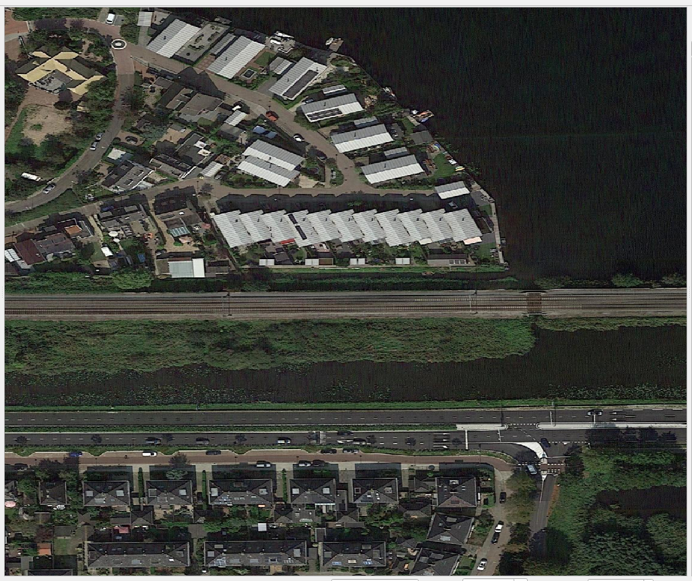
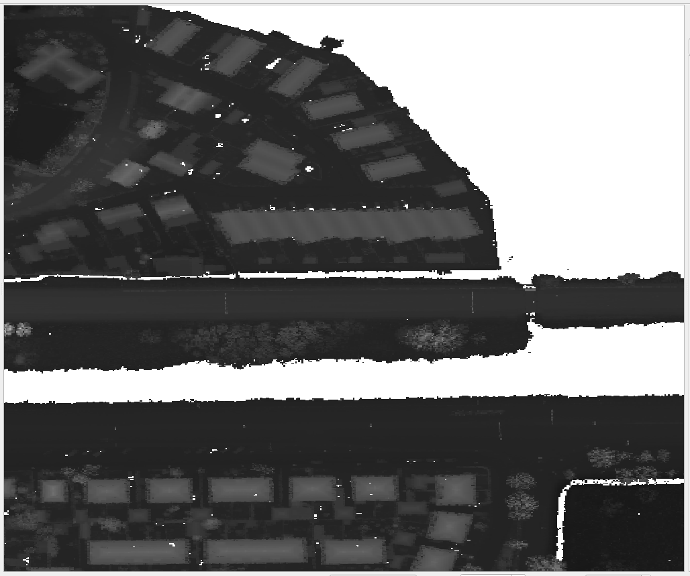

# ahn3-downloader
Download all the 0.5 meter DSM and DTM tiles intersecting with input AOI (Area of Interest)

## Usage
Run the script download_ahn3_elevation_data.py and pass the following arguments:  
- "--aoi": path to input aoi vector file (geojson or shapefile)
- "--out_dir" [optional]: path to out directory where files will be downloaded. 
- "--num_processes" [optioanl]: Number of processes to run in parallel, to speed up downloading
   
Example 1: `python download_ahn3_elevation_data.py --aoi resources/test_aoi.geojson`  
Example 2: `python download_ahn3_elevation_data.py --aoi resources/test_aoi.geojson --out_dir downloaded_data --num_processes 10`
 

## Examples
RGB (left) and corresponding 0.5 meter DSM (Digital Surface Model) (on right)    
 </img>
 </img>
   
 </img>
 </img>
                                            

## About the Data
AHN3 is the open sourced point cloud and elevation raster tiles data with coverage for entire Netherlands collected between 2014-2019 (check sources?). As mentioned on data's [homepage](https://www.pdok.nl/introductie/-/article/actueel-hoogtebestand-nederland-ahn3-)

>The height is measured with laser altimetry: a technique in which an airplane or helicopter scans the earth's surface with a laser beam. The measurement of the transit time of the laser reflection and the attitude and position of the aircraft together give a very accurate result. 

The data can be downloaded via [PDOK download page](https://downloads.pdok.nl/ahn3-downloadpage/).
 
However, this is GUI based method. This repo automates the downloding of 0.5 meter DSM and DTM tiles which intersect with the input AOI. The URLs can be updated to match user's requirement (5 meter raster tiles, or raw point cloud data).

## Caveat
The data is not fit for direct use and requires some pre-processing steps depending on the use case.
There are some no-data values in the raster tiles, which are represented by pixel value: 3.4028235e+38
